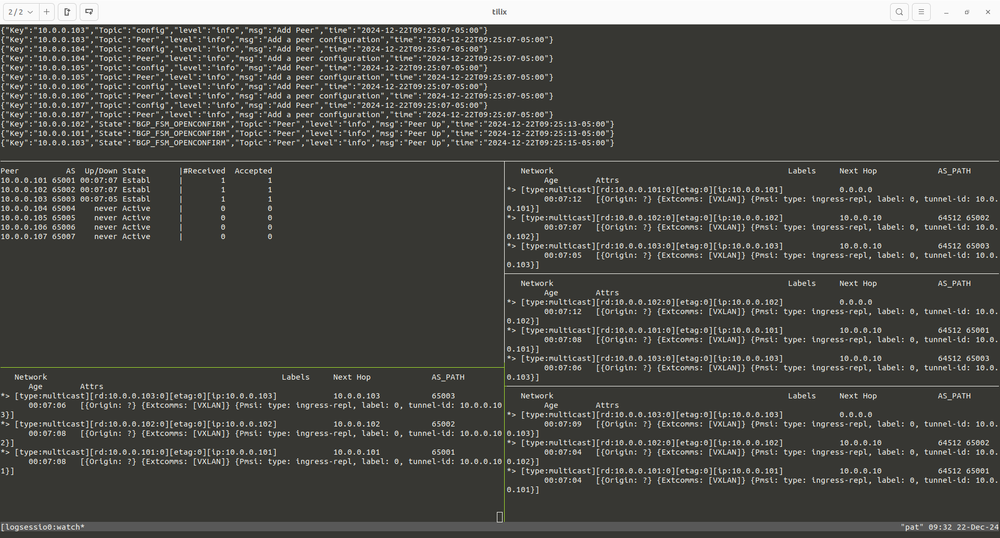

# Introduction
## Problem statement
I want to create an environment where multiple hypervisors are running VMS that need to reside on the same L2 network. These hypervisors are connected 
together on a L3 network. This is similar to running VMs in a cloud environment such as GCP and wanting to create a L2 overlay between them. In this example, I have 3 hosts running 3 VMs in each.


VM1,VM2 and VM3 are able to reach each other automatically after they are created since they are connected on the same bridge. Same thing for VM3-6 and VM7-9. But VM1-3 can't reach any of VM4-9. To solve this problem, we can create an overlay using vxlan.


This diagram shows that by adding a vxlan interface in the bridge, we are able to create an overlay network that makes br0 appear as one big distributed switch.

To do this, we need to create a vxlan interface. Only one of those is needed
```
ip link add vxlan1 type vxlan id 0 dev eth0 dstport 4789
ip link set vxlan1 master br0
ip link set vxlan1 up
```

Then, we need to add entries in the FDB to forward BUM traffic to the other vteps.
```
bridge fdb append to 00:00:00:00:00:00 dst 10.0.0.102 dev vxlan1
bridge fdb append to 00:00:00:00:00:00 dst 10.0.0.103 dev vxlan1
```
Doing this on each hypervisors will create a full-mesh of vtep connections. It can become difficult to manage as we add new hypervisors. For example, if we add a 4th hypervisor in this environment, then we need to go back on the 3 other machines and add an FDB entry. This can be solved with BGP-EVPN.

Note that BGP-EVPN is a bit overkill in this situation because the network relatively easy to manage since we only have one overlay. In a real world scenario, we would probably have multiple overlays to split traffic in different domains. For example, VM1,5,9 might need to be connected one network while the other VMS are connected on different networks. This is a scenario that I will cover another day.

## Solution
We can run gobgp, a BGP server that exposes a GRPC interface for management and monitoring, on each hypervisor to exchange EVPN routes. We need to build a client application that will communicate with gobgp to monitor the route advertisements and make the necessary changes in the FDB.


In this diagram, the orange links represent a BGP channel and the green links are GRPC channels. The BGP topology here uses one master server and all instances that run on hypervisors will exchange routes with this master. We could also have done a full-mesh or ring topology but this is irrelevant for us at this moment. The important thing to note is that we're using ebgp, so each gobgp instances have their own AS.

When we create a new hypervisor, we have a script that creates the bridge and the vxlan interface, spins up the host-agent and gobgp. The script will then invoke the gobgp client tool to advertise the new vtep that was created. For example, if we add a fourth server:
```
gobgp global rib -a evpn add multicast 10.0.0.104 etag 0 rd 10.0.0.104:0 encap vxlan pmsi ingress-repl 0 10.0.0.104
```
This vtep address will get added in the local RIB and advertised to the controller and then back down to all other hypervisors.

## Lab environment
To make this test easier to run, I am creating a virtual environment using network namespaces in linux instead of using hypervisors and VMs. That simulation is a good proof of concept to show how it can work with virtual machines, but also shows that it can be used for container environments.


The shaded boxes are veth pairs. We can see we have a total of 13 namespaces. 

```
pat@pat:~/projects/evpn$ sudo ip netns | grep evpn
evpn-controller (id: 17)
evpn-1 (id: 19)
evpn-e11
evpn-e12
evpn-e13
evpn-2 (id: 20)
evpn-e21
evpn-e22
evpn-e23
evpn-3 (id: 21)
evpn-e31
evpn-e32
evpn-e33
```

The interfaces within the evpn-e11 to evpn-e33 are endpoints similar to vms. evpn-1, evpn-2 and evpn-3 are a simulation of the hypervisors. br-evpn is a bridge on the host that simulates the layer3 network from a cloud operator.

# Running the test
## Building the agent
These steps have been done on a ubuntu VM. The Makefile will use `apt install` to install the required dependencies. The host agent is a c++ application
that communicates with gobgp thru a grpc channel. It monitors changes in the RIB and creates FDB entries for vteps. It is necessary to build the agent before deploying the lab
```
cd host-agent
make install-deps
make build
```

## Creating the virtual lab
The next step is to install gobgp locally. This is done with `make install-gobgp`.
And then we can deploy the lab with `make rebuild-lab`. After starting the lab, we should see all the namespaces and veth pairs created. After the lab is up, we can run `make tail-logs`. This will bring up a tmux session with a few windows to view logs.


We can see here that the controller instance of gobgp has 3 peers in "established" state. and we can see it received 3 routes. The 3 windows on the right show that everyone received routes from everyone. So everything is in sync.

We can run `make test` to check that everyone can ping each other from within their own bridge (without going thru vxlan)
```
pat@pat:~/projects/evpn$ make test
./test-internal.sh 1 3 
Testing that endpoints on same host can ping each other
Ping 10.100.1.102 from 10.100.1.101  Pass
Ping 10.100.1.103 from 10.100.1.101  Pass
Ping 10.100.1.101 from 10.100.1.102  Pass
Ping 10.100.1.103 from 10.100.1.102  Pass
Ping 10.100.1.101 from 10.100.1.103  Pass
Ping 10.100.1.102 from 10.100.1.103  Pass
./test-internal.sh 2 3 
Testing that endpoints on same host can ping each other
Ping 10.100.2.102 from 10.100.2.101  Pass
Ping 10.100.2.103 from 10.100.2.101  Pass
Ping 10.100.2.101 from 10.100.2.102  Pass
Ping 10.100.2.103 from 10.100.2.102  Pass
Ping 10.100.2.101 from 10.100.2.103  Pass
Ping 10.100.2.102 from 10.100.2.103  Pass
./test-internal.sh 3 3 
Testing that endpoints on same host can ping each other
Ping 10.100.3.102 from 10.100.3.101  Pass
Ping 10.100.3.103 from 10.100.3.101  Pass
Ping 10.100.3.101 from 10.100.3.102  Pass
Ping 10.100.3.103 from 10.100.3.102  Pass
Ping 10.100.3.101 from 10.100.3.103  Pass
Ping 10.100.3.102 from 10.100.3.103  Pass
```

This is good. But what about being able to ping across the overlay? We can check that the host-agent has received the mac advertisements and has installed the proper FDB entries:
```
pat@pat:~$ sudo ip netns exec evpn-1 bridge fdb show | grep "00:00:00:00:00:00"
00:00:00:00:00:00 dev vxlan1 dst 10.0.0.102 self permanent
00:00:00:00:00:00 dev vxlan1 dst 10.0.0.103 self permanent
```

So this should work. Let's ping from one host to the other:
```
pat@pat:~$ sudo ip netns exec evpn-e21 ping 10.100.3.101
PING 10.100.3.101 (10.100.3.101) 56(84) bytes of data.
64 bytes from 10.100.3.101: icmp_seq=1 ttl=64 time=0.112 ms
64 bytes from 10.100.3.101: icmp_seq=2 ttl=64 time=0.139 ms
```

And now here's a fun experiment: What happens if I kill the gobgp instance in namespace evpn-3 ? I would exect that because the controller has lost its connection to that neighbor, it would withdraw a route from evpn-1 and evpn-2. And That vtep would in turn be removed from the FDB.

```
# RIB looks good
pat@pat:~$ ip netns exec evpn-1 ./gobgp global rib -a evpn
   Network                                                  Labels     Next Hop             AS_PATH              Age        Attrs
*> [type:multicast][rd:10.0.0.101:0][etag:0][ip:10.0.0.101]            0.0.0.0                                   00:05:55   [{Origin: ?} {Extcomms: [VXLAN]} {Pmsi: type: ingress-repl, label: 0, tunnel-id: 10.0.0.101}]
*> [type:multicast][rd:10.0.0.102:0][etag:0][ip:10.0.0.102]            10.0.0.10            64512 65002          00:05:50   [{Origin: ?} {Extcomms: [VXLAN]} {Pmsi: type: ingress-repl, label: 0, tunnel-id: 10.0.0.102}]
*> [type:multicast][rd:10.0.0.103:0][etag:0][ip:10.0.0.103]            10.0.0.10            64512 65003          00:05:48   [{Origin: ?} {Extcomms: [VXLAN]} {Pmsi: type: ingress-repl, label: 0, tunnel-id: 10.0.0.103}]


# FDB Looks good
pat@pat:~$ ip netns exec evpn-1 bridge fdb show | grep "00:00:00:00:00:00"
00:00:00:00:00:00 dev vxlan1 dst 10.0.0.103 self permanent
00:00:00:00:00:00 dev vxlan1 dst 10.0.0.102 self permanent

# Kill the gobgp server running in evpn-3
pat@pat:~$ kill -9 1542904 

# The RIB is now missing the route for 10.0.0.103
pat@pat:~$ ip netns exec evpn-1 ./gobgp global rib -a evpn
   Network                                                  Labels     Next Hop             AS_PATH              Age        Attrs
*> [type:multicast][rd:10.0.0.102:0][etag:0][ip:10.0.0.102]            10.0.0.10            64512 65002          00:10:27   [{Origin: ?} {Extcomms: [VXLAN]} {Pmsi: type: ingress-repl, label: 0, tunnel-id: 10.0.0.102}]
*> [type:multicast][rd:10.0.0.101:0][etag:0][ip:10.0.0.101]            0.0.0.0                                   00:10:32   [{Origin: ?} {Extcomms: [VXLAN]} {Pmsi: type: ingress-repl, label: 0, tunnel-id: 10.0.0.101}]
pat@pat:~/projects/evpn$ 

# The FDB is now missing the entry for 10.0.0.103
pat@pat:~/projects/evpn$ sudo ip netns exec evpn-1 bridge fdb show | grep "00:00:00:00:00:00"
00:00:00:00:00:00 dev vxlan1 dst 10.0.0.102 self permanent

```

# Multiple VNIs
I modified my scripts again to support multiple VNIs. This way, I can create multiple overlays with isolated domains. This is useful for creating multiple broadcast domains.
There is a way to add 1 single vxlan interface in a bridge and tunnel multiple VNIs at the same time. It is also possible to get the kernel to automatically map VLAN IDs to VNIs when traffic enters the vxlan interface. The procedure goes like this:
- use the keyword "external" when creating the interface: `ip link add vxlan1 type vxlan dev eth0 dstport 4789 external`.
- Enable vlan tunnels on the vxlan interface: `ip link set dev vxlan1 type bridge_slave vlan_tunnel on`
- Enable vlan_filtering on the bridge: `ip link add name br0 type bridge vlan_filtering 1`
- For each interface that we add to the bridge, set the right vlan: `bridge vlan add vid $VLAN pvid untagged dev veth`

We must then create the tunnel mapping. We can create a 1:1 mapping but we could also, for example, want to map vlan 10 to VNI 40000. If we map 1:1, then we will be limited to 4096 VNIs. I am instead mapping an arbitrary number so that I can support the full range of VNI (16 millions) in my entire system but no more than 4096 per hosts. So when creating a new VM, if it gets assigned to a new VNI that doesn't exist yet, then it will be mapped to the next available vlan number on the host. If another VM gets created in a different host, it's possible that a different vlan mapping is created on that host. To create the mapping, we can do:
```
bridge vlan add dev vxlan1 vid ${VLAN}
bridge vlan add dev vxlan1 vid  ${VLAN} tunnel_info id ${VNI}
```

The code in the repo now creates a total of 18 endpoint spread over 3 distinct overlays.
The FDB now looks like this:
```
pat@pat:~$ sudo ip netns exec evpn-1 bridge fdb | grep "00:00:00:00:00:00"
00:00:00:00:00:00 dev vxlan1 dst 10.0.0.102 src_vni 22003 self permanent
00:00:00:00:00:00 dev vxlan1 dst 10.0.0.103 src_vni 22003 self permanent
00:00:00:00:00:00 dev vxlan1 dst 10.0.0.103 src_vni 22001 self permanent
00:00:00:00:00:00 dev vxlan1 dst 10.0.0.102 src_vni 22001 self permanent
00:00:00:00:00:00 dev vxlan1 dst 10.0.0.102 src_vni 22002 self permanent
00:00:00:00:00:00 dev vxlan1 dst 10.0.0.103 src_vni 22002 self permanent
pat@pat:~$ sudo ip netns exec evpn-2 bridge fdb | grep "00:00:00:00:00:00"
00:00:00:00:00:00 dev vxlan1 dst 10.0.0.103 src_vni 22003 self permanent
00:00:00:00:00:00 dev vxlan1 dst 10.0.0.101 src_vni 22003 self permanent
00:00:00:00:00:00 dev vxlan1 dst 10.0.0.103 src_vni 22001 self permanent
00:00:00:00:00:00 dev vxlan1 dst 10.0.0.101 src_vni 22001 self permanent
00:00:00:00:00:00 dev vxlan1 dst 10.0.0.103 src_vni 22002 self permanent
00:00:00:00:00:00 dev vxlan1 dst 10.0.0.101 src_vni 22002 self permanent
pat@pat:~$ sudo ip netns exec evpn-3 bridge fdb | grep "00:00:00:00:00:00"
00:00:00:00:00:00 dev vxlan1 dst 10.0.0.102 src_vni 22003 self permanent
00:00:00:00:00:00 dev vxlan1 dst 10.0.0.101 src_vni 22003 self permanent
00:00:00:00:00:00 dev vxlan1 dst 10.0.0.102 src_vni 22001 self permanent
00:00:00:00:00:00 dev vxlan1 dst 10.0.0.101 src_vni 22001 self permanent
00:00:00:00:00:00 dev vxlan1 dst 10.0.0.102 src_vni 22002 self permanent
00:00:00:00:00:00 dev vxlan1 dst 10.0.0.101 src_vni 22002 self permanent
```

# Graphs
I added a script to generate topology graphs using graphviz. Running `make graph` will generate 3 graphics. The graphics are generated from the information contained in the RIB of the spine BGP instance
The first graphics represents the overall design with each endpoints, vlans and vtep connections.


The second one shows the network from a vlan point of view.


And the 3rd one is a map of the overlays


